# 实验报告
## 简介
本次实验使用两对参数进行模糊测试，分别为有语法检测（G）或无语法检测（nonG），以及timeout触发时间设定为100ms或2000ms。
这份报告会展示四种配置下十个样例的模糊测试结果，并进行对比分析。    
在本次实验中，我们将每次测试结果的覆盖边数随时间变化、执行速度、最终覆盖率进行了记录并制成了图表，以下是具体的测试结果展示。
## 测试结果展示
### 配置一：G-100ms
覆盖边数随时间变化图：
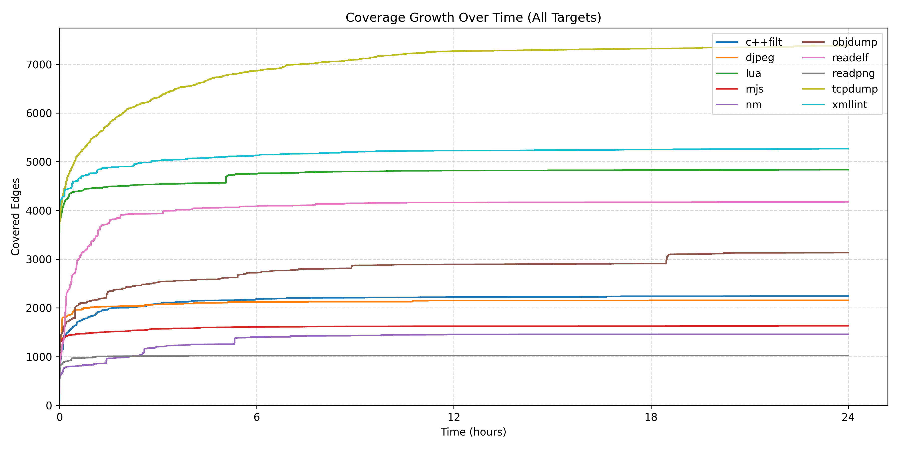
最终覆盖率对比图：
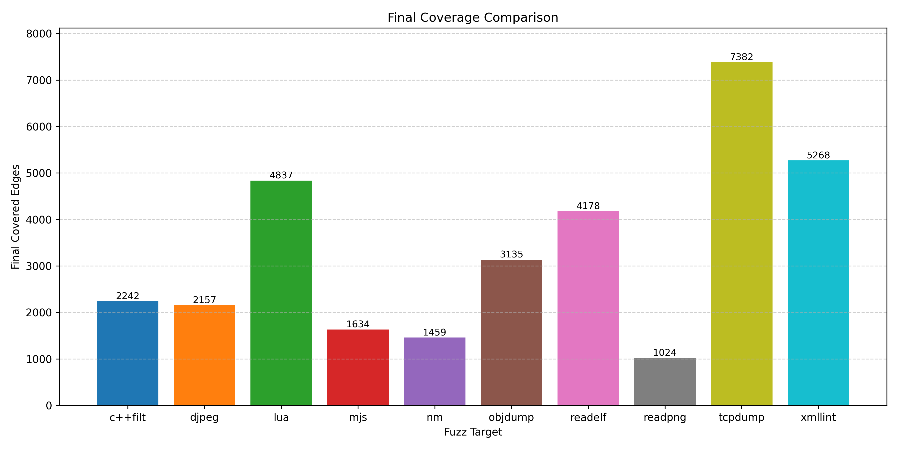
运行速度图（以c++filt的图像为例）：
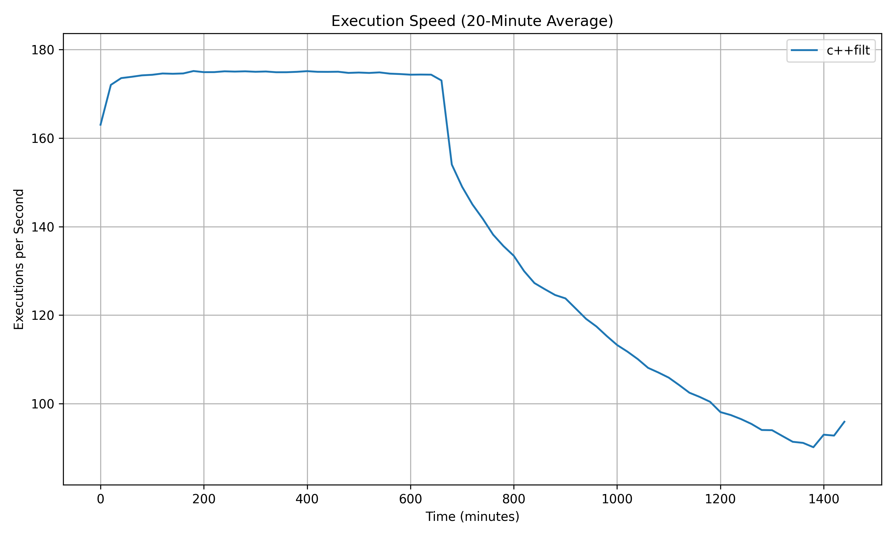
### 配置二：G-2000ms
覆盖边数随时间变化图：
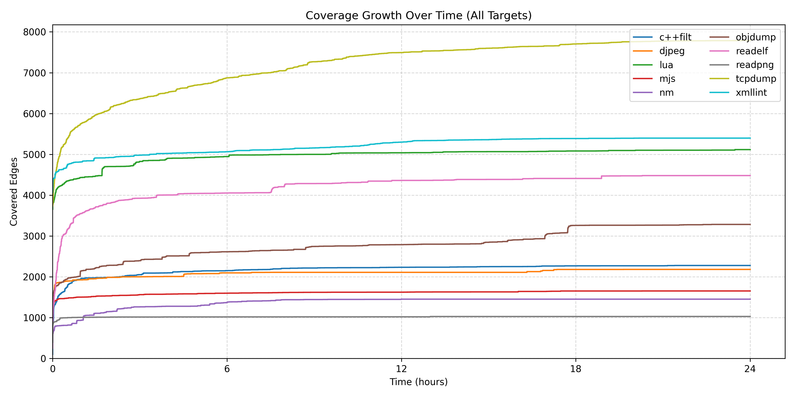
最终覆盖率对比图：
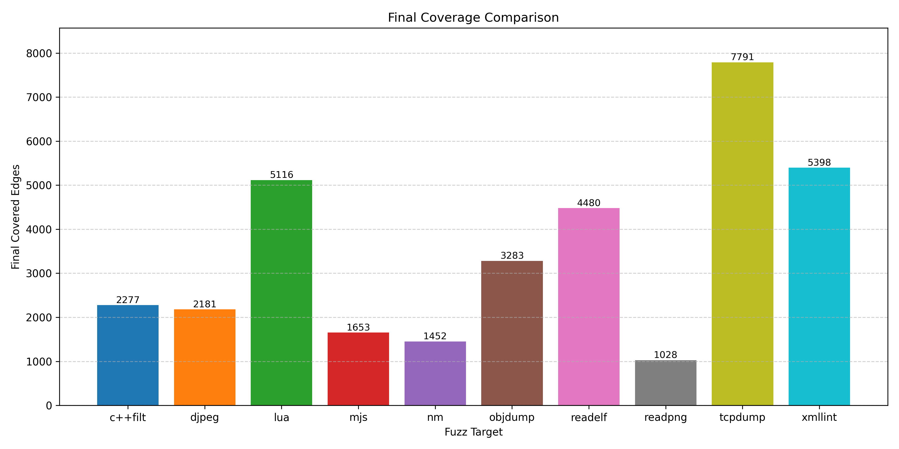
运行速度图（以c++filt的图像为例）：
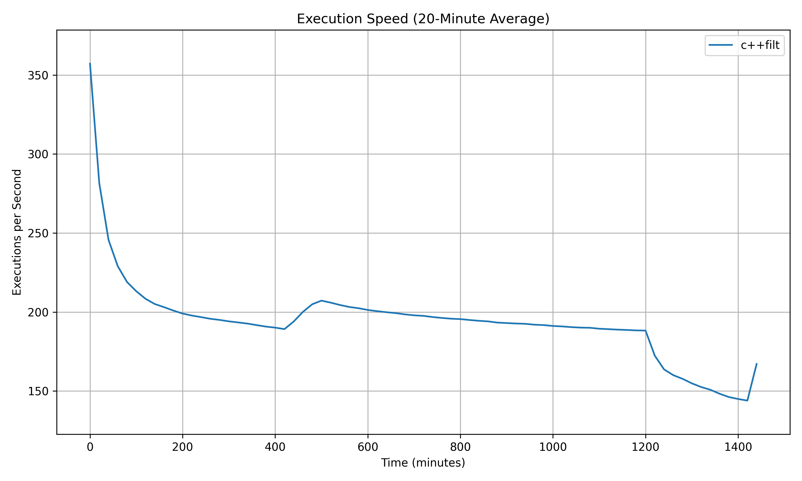
### 配置三：nonG-100ms
覆盖边数随时间变化图：
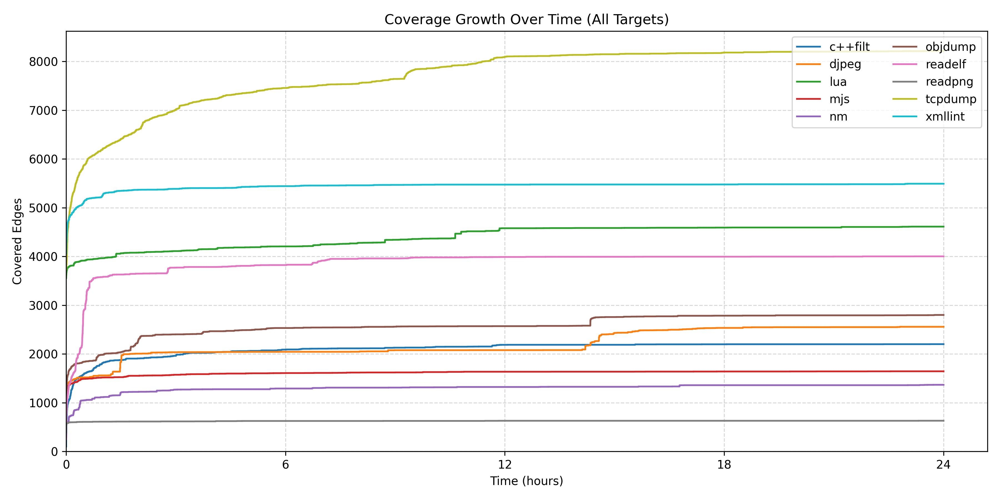
最终覆盖率对比图：

运行速度图（以c++filt的图像为例）：
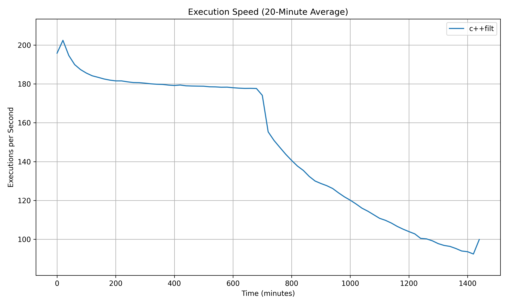
### 配置四：nonG-2000ms
覆盖边数随时间变化图：
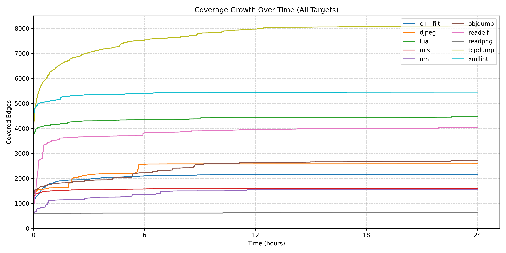
最终覆盖率对比图：
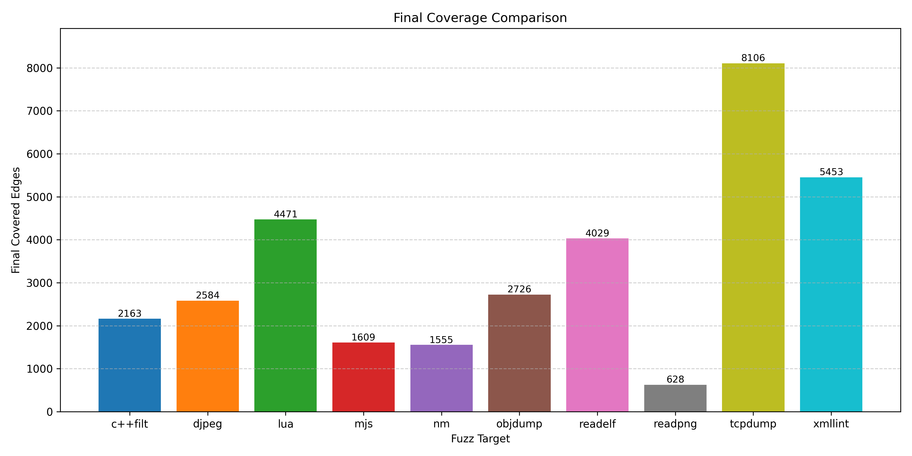
运行速度图（以c++filt的图像为例）：
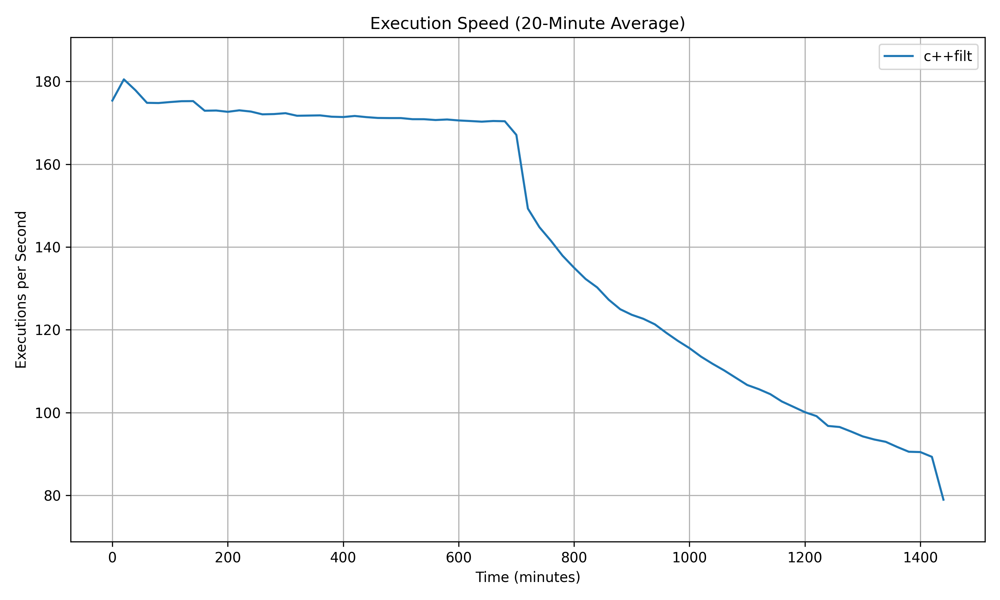
### 纵向对比图
因样例较多，仅选取具有代表性的部分样例展示。
- G结果与nonG结果相差不大的样例（以mjs为例）。    
覆盖边数随时间变化对比图：
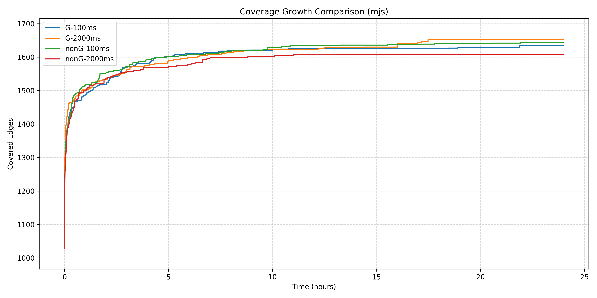
最终覆盖率对比图：
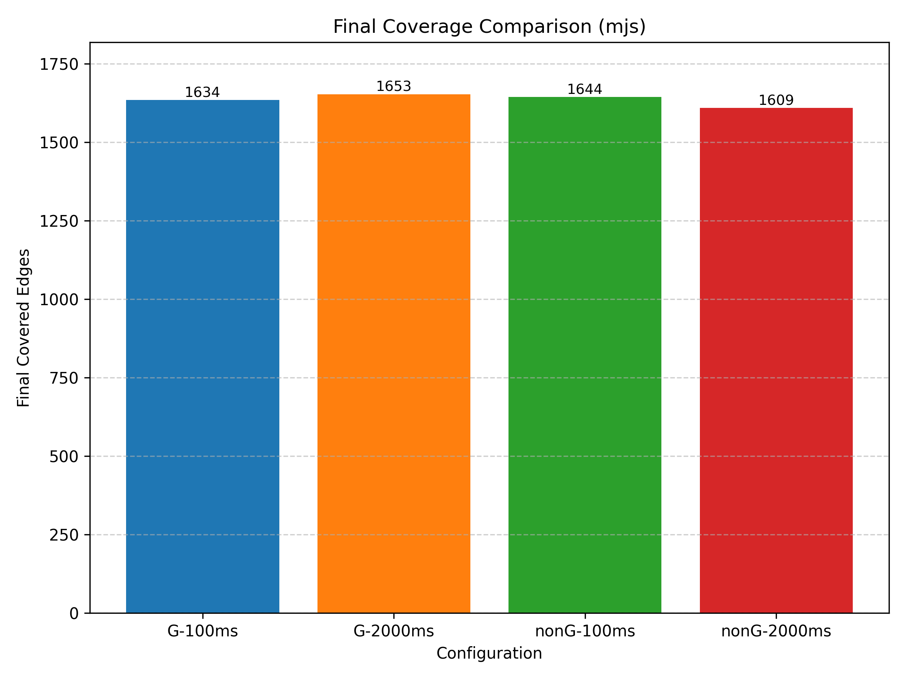
此类结果在全部结果中占多数。

- G结果较显著优于nonG结果的样例（以readpng为例）。    
覆盖边数随时间变化对比图：
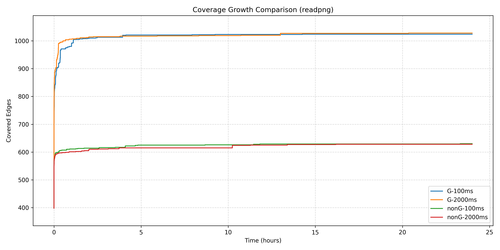
最终覆盖率对比图：
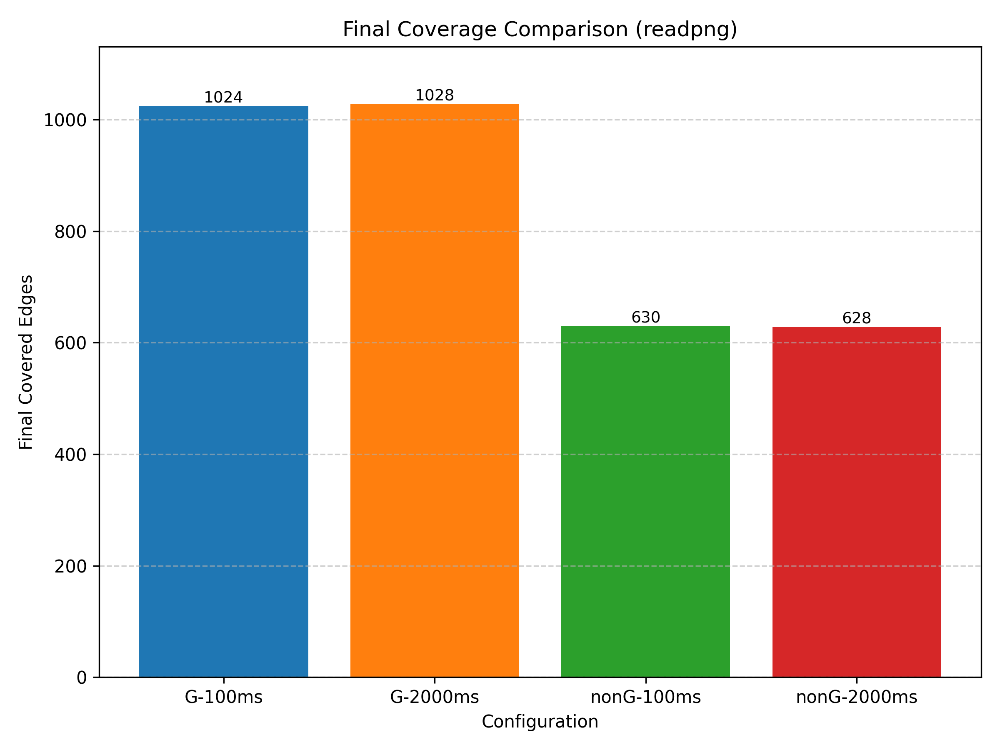
此类结果在全部结果中占少数。

- nonG结果较显著优于G结果的样例（以djpeg为例）。     
覆盖边数随时间变化对比图：
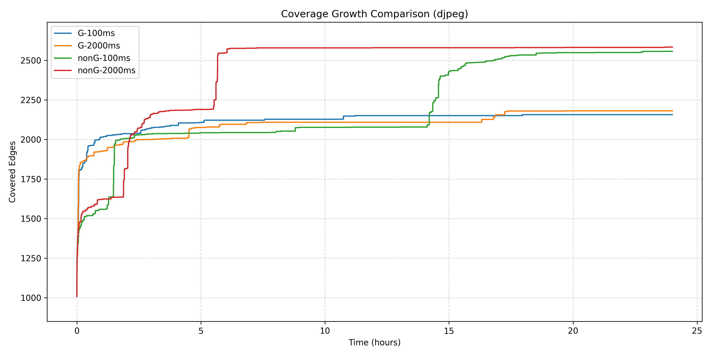
最终覆盖率对比图：
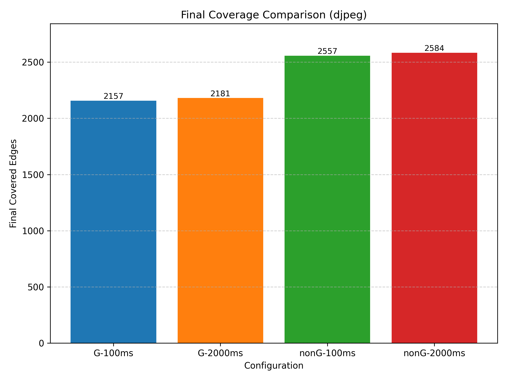
此类结果在全部结果中较少。

## 结果分析
### 共性分析
基于以上数据可以得出，覆盖边数的共性增长规律大致为：
1. 初期快速增长：大多数样例在测试开始的短时间内（前期）覆盖边数增速较快，曲线陡峭，说明容易触达的路径或缺陷被优先发现。
2. 增长减缓并趋于平稳：随着时间推进，新增覆盖显著减少，曲线出现拐点并逐步平缓，呈现典型的边际效益递减。
3. 个别跳跃式增长：少数样例在中后期出现明显的跳跃，表示偶然触发了新的代码区域（例如新的种子或特定变异策略奏效）。
4. 长尾分布：部分样例在测试末仍有缓慢上升趋势，存在难以触达的代码路径，需要更长时间或更有针对性的策略才能发现更多覆盖。 

### 配置对比分析
1. 语法检测（G）与非语法检测（nonG）的影响
   - 多数样例（c++filt，mjs，nm，readelf，xmllint）中，G配置的覆盖率并未显著优于nonG配置，表明语法检测在这些情况下并未带来明显优势。
   - 少数样例（djpeg，tcpdump）中，nonG配置的情况较显著优于G配置，可能是因为语法检测限制了变异的多样性，导致难以触达某些代码路径。
   - 少数样例（lua，readpng，objdump）中，G配置的覆盖率较显著优于nonG配置（在readpng中差距尤为明显），表明语法检测在这些情况下有效提升了测试效率，帮助更快发现更多路径。
2. Timeout设置的影响
   - 在全部样例中，timeout设置为2000ms相较于100ms并未产生显著差距。
3. 不同配置下运行速度的差异
   - 在同一配置下，十个样例的运行速度曲线大致相似。
   - 不同配置下，运行速度曲线趋势也大致相同，均呈现向下趋势，说明随着测试时间增加，单次执行的速度有所下降，可能是由于种子库增大导致的调度开销增加。
   - 不同配置间的运行速度差异不大，说明语法检测和timeout设置对单次执行速度影响有限。
## 结论
本次实验完成了对十个样例在四种配置下的模糊测试，得到结论：
1. 最终覆盖边数主要受样例本身复杂度和模糊测试策略影响，参数配置的作用相对次要。
2. 参数配置对覆盖率的影响因样例而异，总体影响有限。
3. 语法检测在部分样例中有效提升了覆盖率，但在多数样例中未见显著优势。
4. Timeout设置对覆盖率影响不大。
5. 运行速度随时间略有下降，但不同配置间差异不大。

总体来看，模糊测试的效果更多依赖于样例特性和测试策略，而非单一参数配置。未来可进一步探索更复杂的参数组合及其对不同类型样例的影响。
